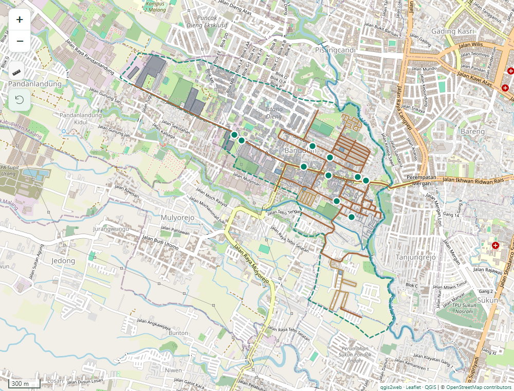

# 🗺️ Bandulan Warung GIS

**Interactive WebGIS for Local Business Mapping**

Explore warung locations alongside roads, buildings, public facilities, and the surrounding landscape in Bandulan, Malang, Indonesia. Built with QGIS, qgis2web, Leaflet, and a custom static frontend.

## 🌐 Live Demo

[🌐 Live Demo](https://freddy47588.github.io/bandulan-warung-gis/) · [🗺️ Interactive Map](https://freddy47588.github.io/bandulan-warung-gis/map/) · [💻 View Source](https://github.com/Freddy47588/bandulan-warung-gis)

## 🖼️ Preview



Open the interactive map using the links above, or see the [original QGIS map layout](images/Layout_Peta_Bandulan.png).

## 📌 Overview

Bandulan Warung GIS visualizes the spatial distribution of small local businesses in Kelurahan Bandulan, Kecamatan Sukun, Malang, East Java. It brings together business locations, the road network, land use, and public facilities in a browser-based map.

The project connects spatial data preparation in QGIS with publication through qgis2web and Leaflet. A custom landing page and map dashboard present the results as a static website that can run on GitHub Pages without a backend or build pipeline.

## ✨ Features

- **Interactive map:** pan, zoom, reset the study-area view, and share map-view URLs.
- **Warung discovery:** search ten locations by name or address, then open a feature card.
- **Grouped layers:** toggle eleven spatial layers with a synchronized legend and feature counts.
- **Feature details:** readable popups with English attribute labels, original place names, and empty values omitted.
- **Measurement:** measure distances and areas in metric units.
- **Map utilities:** locate yourself with browser permission, use a metric scale, or enter fullscreen where supported.
- **Responsive interface:** a collapsible desktop sidebar, mobile layer drawer, and embedded landing-page preview.
- **Keyboard support:** labeled controls, focus indicators, searchable results, and focusable warung markers.

## 🧭 Spatial Data Layers

Counts represent features in the bundled datasets, rather than a complete inventory of the area.

| Layer | Geometry | Features | Dataset |
| --- | --- | ---: | --- |
| Warung Locations | Point | 10 | `LokasiWarung_11.js` |
| Bandulan Boundary | MultiPolygon | 1 | `BatasKelurahan_1.js` |
| Village Roads | MultiLineString | 39 | `JalanDesa_10.js` |
| Residential Roads | MultiLineString | 23 | `JalanPerumahan_9.js` |
| Alleys | MultiLineString | 52 | `JalanGang_8.js` |
| Buildings | MultiPolygon | 250 | `Bangunan_4.js` |
| Residential Areas | MultiPolygon | 15 | `Pemukiman_2.js` |
| Green Spaces | MultiPolygon | 4 | `LahanTerbukaHijau_5.js` |
| Schools | MultiPolygon | 6 | `Sekolah_3.js` |
| Factories | MultiPolygon | 5 | `Pabrik_6.js` |
| Rivers | MultiLineString | 2 | `Sungai_7.js` |

Datasets live in [`map/data/`](map/data/) as JavaScript-wrapped GeoJSON. Original Indonesian filenames, attributes, place names, coordinates, and geometries are retained.

## 🛠️ Technology Stack

| Technology | Role |
| --- | --- |
| QGIS | Spatial data preparation and cartographic layout |
| qgis2web | Export of QGIS layers to a browser-based map |
| Leaflet.js | Interactive rendering, layers, popups, and map controls |
| OpenStreetMap | Basemap tiles |
| HTML, CSS, JavaScript | Custom static landing page and map interface |
| GitHub Pages | Static hosting |

The frontend uses local CSS and JavaScript without a framework, CSS CDN, or package installation step. Existing qgis2web dependencies remain bundled in `map/`.

## 🔄 Project Workflow

QGIS → Spatial Data Preparation → qgis2web Export → Leaflet WebGIS → Custom Frontend Enhancement → GitHub Pages

The qgis2web export supplies the spatial layers and mapping foundation. Separate custom styles and scripts provide the portfolio presentation, layer metadata, search, and responsive controls.

## 📁 Project Structure

```text
bandulan-warung-gis/
├── index.html                 # Portfolio landing page
├── README.md
├── assets/
│   ├── css/
│   │   ├── shared.css         # Shared design tokens and controls
│   │   └── landing.css        # Landing-page layout
│   ├── js/landing.js          # Responsive navigation
│   ├── favicon.svg
│   └── icons.svg              # Shared line-icon sprite
├── images/
│   ├── Layout_Peta_Bandulan.png
│   └── map-preview.png        # Screenshot of the interactive map
└── map/
    ├── index.html             # App shell and qgis2web initialization
    ├── data/                  # Original spatial datasets
    ├── css/map.css            # Custom map presentation
    ├── js/
    │   ├── map-config.js      # Layer labels, colors, and field metadata
    │   └── map-ui.js          # Sidebar, search, popups, and controls
    ├── images/
    ├── legend/
    └── webfonts/
```

The `map/css/` and `map/js/` directories also contain the existing qgis2web and third-party dependencies. Custom files are separate from those libraries. Re-exporting from QGIS may overwrite `map/index.html`; preserve its app shell, attribution, and custom-script integration when updating the export.

## 🚀 Running Locally

Clone the repository and start a local HTTP server from its root. Python 3 is sufficient; no package installation or build step is needed.

```sh
git clone https://github.com/Freddy47588/bandulan-warung-gis.git
cd bandulan-warung-gis
python -m http.server 8000
```

Open the [landing page](http://localhost:8000/) or the [interactive map](http://localhost:8000/map/).

An internet connection is needed for OpenStreetMap tiles. The bundled spatial layers remain available if tiles fail to load. Location access requires browser permission and a secure context such as HTTPS or localhost. Fullscreen availability depends on the browser and embedding context.

## ☁️ Deployment

The project is compatible with GitHub Pages served from the repository root. In **Settings → Pages**, select the intended deployment branch and **/ (root)** as the publishing folder.

The public site uses [Bandulan Warung GIS](https://freddy47588.github.io/bandulan-warung-gis/), with the interactive map under `map/`. Relative asset paths support this repository URL prefix. No backend, API key, or build command is required.

## 🗃️ Data Sources & Attribution

- [QGIS](https://qgis.org/) is the GIS authoring tool used for spatial preparation and the original map layout.
- [qgis2web](https://github.com/qgis2web/qgis2web) provides the web export tooling.
- [Leaflet](https://leafletjs.com/) provides the browser mapping library.
- Basemap data is © [OpenStreetMap contributors](https://www.openstreetmap.org/copyright). Attribution is displayed on the map while the basemap is active.

The spatial layers are preserved from the existing project export. Complete per-layer provenance, collection dates, and reuse terms are not documented in this repository. The project does not claim ownership of third-party geographic data; verify its source and permissions before redistribution or reuse.

## 🎯 Project Background

This project demonstrates a GIS publication workflow: preparing spatial layers, designing a thematic map, exporting it to the web, and presenting the result as a portfolio application. Its focus is the relationship between local businesses and their geographic context in Bandulan.

## 🔮 Future Improvements

- Spatial filtering by area and proximity to roads or facilities.
- More detailed warung information and documented update dates.
- Business category filters and summary analytics.
- Further accessibility testing across browsers and assistive technologies.
- Clearer dataset provenance and licensing documentation.

## 📄 License

No project-wide license file is currently included. This README does not grant a blanket reuse license for the application or spatial datasets. Third-party libraries and geographic data remain subject to their respective licenses and terms.
